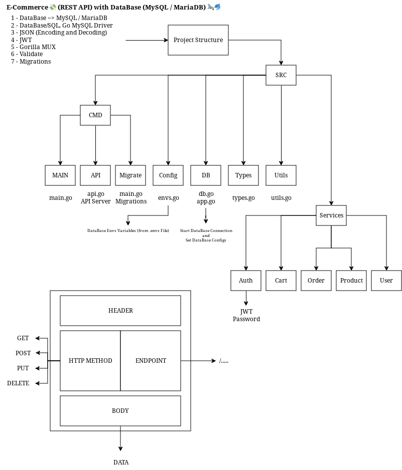

# ecom-sql-rest-api

⚠️ **NOTE!!!!!** This Goalng App Written for Me - So some Things Might not Work on Your PC or Laptop as this was Never Intended to be a Usable Full Fledged Application, in that Case, Please Try if You Can Fix that Up as Much as Possible, or you can Open an Issue for Help :) - You Need to Change Something Related to Database (in Makefile, docker-compose.yml and ...) - So Please Check Everything Before Running the Database and Server.



## Requirements

- make
- [MySQL](https://www.mysql.com/) / [MariaDB](https://mariadb.org/)
- [MariaDB Docker Image](https://hub.docker.com/_/mariadb)
- Create a Docker Network to Connect Golang Server Container and MariaDB Container with Each other
- [Migrate (for DB Migrations)](https://github.com/golang-migrate/migrate/tree/v4.17.0/cmd/migrate)

## Makefile

A Standard GNU Make File is Provided to Help with Running and Building Locally.

```text
help                 💬 This Help Message
lint                 🔎 Lint & Format, will not Fix but Sets Exit Code on Error
lint-fix             📜 Lint & Format, will Try to Fix Errors and Modify Code
test                 🧪 Go Unit Test - Tests a Specific Piece of Code from a Program or Package
migrate-up           🔺 Database Migrations - Create a Required Tables in Database (ecom)
migrate-down         🔻 Database Migrations - Drop a Tables in Database (ecom)
build                🔨 Build Binary File
run                  >_ Run the Web Server Locally at PORT 9010
init                 📥 Download Dependencies From go.mod File
clean                🧹 Clean up Project
mariadb              🦭 Pull MariaDB Docker Image from Docker Hub Registry
mysql                🐬 Pull MySQL Docker Image from Docker Hub Registry
docker-network       🪡 Create Docker Network
image                📦 Build Docker Container Image from Dockerfile
push                 📤 Push Container Image to Registry
compose-up           🧷 Create and Start Containers
compose-down         🧼 Stop and Remove Containers, Networks
```

Makefile Variables

| Makefile Variable | Default                 |
| ----------------- | ----------------------- |
| SRC_DIR           | ./src/                  |
| DEFAULT_GOAL      | help                    |
| BINARY_NAME       | main                    |
| BINARY_DIR        | ./bin/                  |
| IMAGE_REPO        | soelz/ecom-sql-rest-api |
| IMAGE_TAG         | 0.1                     |
| MariaDB_IMAGE     | mariadb:lts             |
| MySQL_IMAGE       | mysql:lts               |

## Containers

RUN Server in a Container

```bash
docker run --name mariadb --network backend -e MYSQL_ROOT_PASSWORD=root -e MYSQL_DATABASE=ecom -e MYSQL_USER=sz -e MYSQL_PASSWORD=1234 -p 3306:3306 -d mariadb:lts
```

```bash
docker run --name ecom --network backend -p 9010:9010 soelz/ecom-sql-rest-api
```

OR

Just Execute this Command ~>

```bash
make compose-up
```

<p align="center">
  <picture>
    <source srcset="https://raw.githubusercontent.com/nordtheme/assets/main/static/images/elements/separators/iceberg/footer/dark/spaced.svg" width="100%" media="(prefers-color-scheme: light), (prefers-color-scheme: no-preference)" />
    <source srcset="https://raw.githubusercontent.com/nordtheme/assets/main/static/images/elements/separators/iceberg/footer/light/spaced.svg" width="100%" media="(prefers-color-scheme: dark)" />
    
  </picture>
</p>
